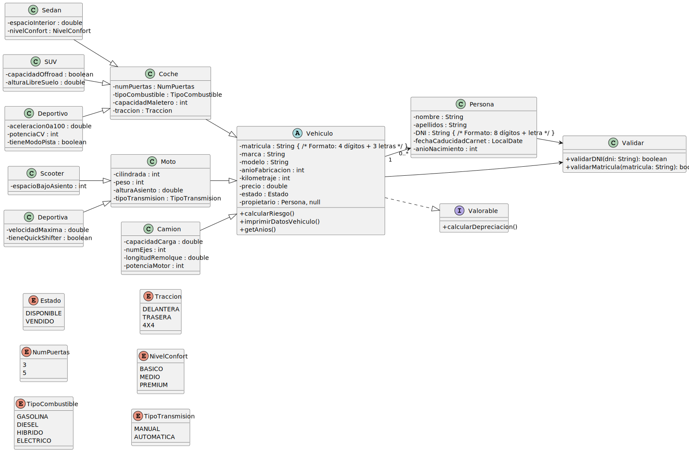

# UT5_ED_Prog

**Checklist de tareas a realizar:**

- [x] Crea un repositorio llamado UT5_ED_Prog.

- [x] Añade un README.md con una checklist de tareas.

- [x] Crea una carpeta uml/ con un fichero .puml por cada clase detectada, con esta estructura inicial:

      @startuml
      class Vehiculo {
      }
      @enduml

- [x] Haz el primer commit con la estructura base súbelo al remoto (github).

- [x] Modela progresivamente atributos, métodos y relaciones entre clases.

- [x] Genera un diagrama UML en formato .svg con PlantUML.

- [x] Inserta el diagrama en el README.md con:

      

